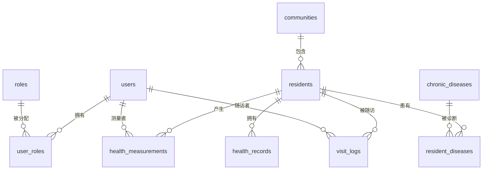

# 社区健康档案管理系统 — 数据库设计文档

> **数据库**：MySQL 8.0+  
> **字符集**：`utf8mb4`  
> **设计范式**：严格遵守第三范式 (3NF)

---

## 一、ER 关系图

---

## 二、表结构设计 (10 张表)

### 表 1：`users` — 系统用户表

| 字段名 | 类型 | 约束 | 说明 |
|--------|------|------|------|
| `id` | INT | PK, AUTO_INCREMENT | 用户 ID |
| `username` | VARCHAR(50) | UNIQUE, NOT NULL | 登录账号 |
| `password_hash` | VARCHAR(255) | NOT NULL | 密码哈希值 |
| `real_name` | VARCHAR(50) | NOT NULL | 真实姓名 |
| `phone` | VARCHAR(20) | | 手机号 |
| `status` | TINYINT | DEFAULT 1 | 状态：1 启用 / 0 禁用 |
| `created_at` | DATETIME | DEFAULT CURRENT_TIMESTAMP | 创建时间 |
| `updated_at` | DATETIME | ON UPDATE CURRENT_TIMESTAMP | 更新时间 |

---

### 表 2：`roles` — 角色表

| 字段名 | 类型 | 约束 | 说明 |
|--------|------|------|------|
| `id` | INT | PK, AUTO_INCREMENT | 角色 ID |
| `role_name` | VARCHAR(30) | UNIQUE, NOT NULL | 角色名（管理员/医生/护士）|
| `description` | VARCHAR(100) | | 角色描述 |

---

### 表 3：`user_roles` — 用户角色关联表

| 字段名 | 类型 | 约束 | 说明 |
|--------|------|------|------|
| `id` | INT | PK, AUTO_INCREMENT | 主键 |
| `user_id` | INT | FK → users.id, NOT NULL | 用户 ID |
| `role_id` | INT | FK → roles.id, NOT NULL | 角色 ID |

> 复合唯一索引：`UNIQUE(user_id, role_id)`

---

### 表 4：`communities` — 社区信息表

| 字段名 | 类型 | 约束 | 说明 |
|--------|------|------|------|
| `id` | INT | PK, AUTO_INCREMENT | 社区 ID |
| `name` | VARCHAR(100) | NOT NULL | 社区名称 |
| `address` | VARCHAR(255) | | 社区地址 |
| `contact_phone` | VARCHAR(20) | | 联系电话 |
| `created_at` | DATETIME | DEFAULT CURRENT_TIMESTAMP | 创建时间 |

---

### 表 5：`residents` — 居民基本信息表

| 字段名 | 类型 | 约束 | 说明 |
|--------|------|------|------|
| `id` | INT | PK, AUTO_INCREMENT | 居民 ID |
| `name` | VARCHAR(50) | NOT NULL | 姓名 |
| `gender` | ENUM('男','女') | NOT NULL | 性别 |
| `id_card` | VARCHAR(18) | UNIQUE, NOT NULL | 身份证号 |
| `birth_date` | DATE | NOT NULL | 出生日期 |
| `phone` | VARCHAR(20) | | 联系电话 |
| `community_id` | INT | FK → communities.id | 所属社区 |
| `address` | VARCHAR(255) | | 详细地址 |
| `emergency_contact` | VARCHAR(50) | | 紧急联系人 |
| `emergency_phone` | VARCHAR(20) | | 紧急联系人电话 |
| `created_at` | DATETIME | DEFAULT CURRENT_TIMESTAMP | 建档时间 |
| `updated_at` | DATETIME | ON UPDATE CURRENT_TIMESTAMP | 更新时间 |

---

### 表 6：`health_records` — 健康档案摘要表

| 字段名 | 类型 | 约束 | 说明 |
|--------|------|------|------|
| `id` | INT | PK, AUTO_INCREMENT | 档案 ID |
| `resident_id` | INT | FK → residents.id, UNIQUE | 居民 ID（一人一档）|
| `blood_type` | VARCHAR(10) | | 血型 |
| `allergy_history` | TEXT | | 过敏史 |
| `family_history` | TEXT | | 家族病史 |
| `past_medical_history` | TEXT | | 既往病史 |
| `created_at` | DATETIME | DEFAULT CURRENT_TIMESTAMP | 创建时间 |
| `updated_at` | DATETIME | ON UPDATE CURRENT_TIMESTAMP | 更新时间 |

---

### 表 7：`health_measurements` — 健康测量数据表

| 字段名 | 类型 | 约束 | 说明 |
|--------|------|------|------|
| `id` | INT | PK, AUTO_INCREMENT | 测量 ID |
| `resident_id` | INT | FK → residents.id, NOT NULL | 居民 ID |
| `systolic` | INT | | 收缩压 (mmHg) |
| `diastolic` | INT | | 舒张压 (mmHg) |
| `blood_sugar` | DECIMAL(5,2) | | 血糖 (mmol/L) |
| `heart_rate` | INT | | 心率 (次/分) |
| `height` | DECIMAL(5,1) | | 身高 (cm) |
| `weight` | DECIMAL(5,1) | | 体重 (kg) |
| `bmi` | DECIMAL(4,1) | | BMI 指数 |
| `notes` | TEXT | | 备注 |
| `measured_by` | INT | FK → users.id | 测量人 |
| `measured_at` | DATETIME | DEFAULT CURRENT_TIMESTAMP | 测量时间 |

---

### 表 8：`chronic_diseases` — 慢性病字典表

| 字段名 | 类型 | 约束 | 说明 |
|--------|------|------|------|
| `id` | INT | PK, AUTO_INCREMENT | 疾病 ID |
| `disease_name` | VARCHAR(100) | UNIQUE, NOT NULL | 疾病名称 |
| `disease_code` | VARCHAR(20) | | ICD 编码 |
| `category` | VARCHAR(50) | | 疾病分类 |
| `description` | TEXT | | 疾病描述 |

---

### 表 9：`resident_diseases` — 居民慢性病关联表

| 字段名 | 类型 | 约束 | 说明 |
|--------|------|------|------|
| `id` | INT | PK, AUTO_INCREMENT | 主键 |
| `resident_id` | INT | FK → residents.id, NOT NULL | 居民 ID |
| `disease_id` | INT | FK → chronic_diseases.id, NOT NULL | 疾病 ID |
| `diagnosed_date` | DATE | | 确诊日期 |
| `status` | ENUM('治疗中','已痊愈','控制中') | DEFAULT '治疗中' | 状态 |
| `notes` | TEXT | | 备注说明 |

> 复合唯一索引：`UNIQUE(resident_id, disease_id)`

---

### 表 10：`visit_logs` — 随访记录表

| 字段名 | 类型 | 约束 | 说明 |
|--------|------|------|------|
| `id` | INT | PK, AUTO_INCREMENT | 记录 ID |
| `resident_id` | INT | FK → residents.id, NOT NULL | 被随访居民 |
| `visitor_user_id` | INT | FK → users.id, NOT NULL | 随访人员 |
| `visit_type` | VARCHAR(30) | | 随访方式（上门/电话/门诊）|
| `visit_date` | DATE | NOT NULL | 随访日期 |
| `content` | TEXT | | 随访内容 |
| `next_visit_date` | DATE | | 下次随访日期 |
| `created_at` | DATETIME | DEFAULT CURRENT_TIMESTAMP | 记录创建时间 |

---

## 三、索引设计

| 表名 | 索引名 | 字段 | 类型 |
|------|--------|------|------|
| `users` | `idx_username` | `username` | UNIQUE |
| `residents` | `idx_id_card` | `id_card` | UNIQUE |
| `residents` | `idx_community` | `community_id` | INDEX |
| `residents` | `idx_name` | `name` | INDEX |
| `health_measurements` | `idx_resident_time` | `resident_id, measured_at` | INDEX |
| `visit_logs` | `idx_resident_date` | `resident_id, visit_date` | INDEX |
| `resident_diseases` | `idx_resident_disease` | `resident_id, disease_id` | UNIQUE |

---

## 四、3NF 分析说明

| 范式 | 满足情况 | 说明 |
|------|---------|------|
| **1NF** | ✅ | 所有字段均为原子值，无复合属性 |
| **2NF** | ✅ | 所有非键属性完全函数依赖于主键，无部分依赖 |
| **3NF** | ✅ | 无传递依赖，例如：社区信息独立为 `communities` 表，慢性病独立为 `chronic_diseases` 字典表，角色独立为 `roles` 表 |

> [!NOTE]
> `health_records` 表的 `resident_id` 设置了 UNIQUE 约束，保证"一人一档"的业务规则。`health_measurements` 允许多条记录对应一个居民（一人多次测量）。

---

## 五、辅助表（由触发器自动写入）

### 表 A：`audit_logs` — 审计日志表

| 字段名 | 类型 | 说明 |
|--------|------|------|
| `id` | INT PK | 日志 ID |
| `table_name` | VARCHAR(50) | 操作表名 |
| `operation` | VARCHAR(10) | 操作类型 (INSERT/UPDATE/DELETE) |
| `record_id` | INT | 记录 ID |
| `old_data` | JSON | 操作前数据 |
| `new_data` | JSON | 操作后数据 |
| `operated_at` | DATETIME | 操作时间 |

### 表 B：`health_warnings` — 健康预警记录表

| 字段名 | 类型 | 说明 |
|--------|------|------|
| `id` | INT PK | 预警 ID |
| `measurement_id` | INT FK | 测量记录 ID |
| `resident_id` | INT FK | 居民 ID |
| `warning_type` | VARCHAR(50) | 预警类型（高血压/低血压/高血糖/低血糖/心率异常）|
| `warning_msg` | VARCHAR(255) | 预警内容 |
| `warning_level` | ENUM('低','中','高') | 预警等级 |
| `is_handled` | TINYINT | 是否已处理 |
| `created_at` | DATETIME | 创建时间 |

---

## 六、视图设计（5 个）

| 视图名 | 用途 | 关联表 |
|--------|------|--------|
| `v_resident_info` | 居民完整信息（含社区名、年龄计算） | residents + communities |
| `v_latest_measurement` | 每位居民最新测量数据 + 血压/血糖预警标记 | health_measurements + residents + users |
| `v_resident_disease_detail` | 居民慢性病详情 | resident_diseases + residents + chronic_diseases |
| `v_visit_detail` | 随访记录详情（含居民和随访人姓名） | visit_logs + residents + communities + users |
| `v_system_overview` | 系统统计概览（居民总数、预警数等） | 多表聚合 |

> 详见 [views.sql](file:///e:/CppTrainingProject/DatabaseCourseDesign/sql/views.sql)

---

## 七、存储过程设计（3 个）

| 存储过程名 | 用途 |
|-----------|------|
| `sp_add_measurement` | 录入测量数据，自动计算 BMI，输出预警信息 |
| `sp_get_resident_health_profile` | 居民健康档案综合查询（返回 5 个结果集） |
| `sp_community_health_stats` | 按社区统计健康预警数据 |

> 详见 [procedures.sql](file:///e:/CppTrainingProject/DatabaseCourseDesign/sql/procedures.sql)

---

## 八、触发器设计（4 个）

| 触发器名 | 触发时机 | 用途 |
|---------|---------|------|
| `trg_after_resident_insert` | 居民 INSERT 后 | 自动创建健康档案摘要记录 |
| `trg_before_resident_delete` | 居民 DELETE 前 | 记录删除审计日志 |
| `trg_after_measurement_insert` | 测量数据 INSERT 后 | 自动检测异常并写入 health_warnings 预警表 |
| `trg_after_resident_update` | 居民 UPDATE 后 | 记录关键字段变更审计日志 |

> 详见 [triggers.sql](file:///e:/CppTrainingProject/DatabaseCourseDesign/sql/triggers.sql)

---

## 九、用户权限管理

| 数据库用户 | 角色 | 权限范围 |
|-----------|------|---------|
| `ch_admin` | 管理员 | 全部权限 (ALL PRIVILEGES) |
| `ch_doctor` | 医生 | 居民/健康/随访表的 SELECT+INSERT+UPDATE，视图 SELECT，存储过程 EXECUTE |
| `ch_nurse` | 护士 | 居民表 SELECT，测量表 SELECT+INSERT，sp_add_measurement EXECUTE |
| `ch_readonly` | 只读 | 全部表和视图的 SELECT |

> 详见 [permissions.sql](file:///e:/CppTrainingProject/DatabaseCourseDesign/sql/permissions.sql)

---

## 十、SQL 脚本文件说明

| 文件 | 用途 | 执行顺序 |
|------|------|---------|
| `sql/init.sql` | 建库建表 + 初始角色/管理员/社区/慢性病数据 | ① |
| `sql/views.sql` | 创建 5 个查询视图 | ② |
| `sql/procedures.sql` | 创建 3 个存储过程 | ③ |
| `sql/triggers.sql` | 创建审计日志表 + 预警表 + 4 个触发器 | ④ |
| `sql/permissions.sql` | 创建数据库用户并分配权限 | ⑤ |
| `sql/seed.sql` | 导入测试种子数据 | ⑥ |
