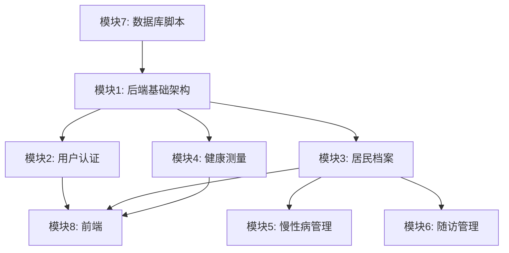

# 社区健康档案管理系统 — 项目模块分工

> **技术架构**：B/S 模式，前后端分离 (C++ 后端 + Web 前端 + MySQL)  
> **团队规模**：3-4 人

---

## 一、程序设计模块分工

### 模块 1：后端基础架构

| 任务 | 产出文件 | 优先级 |
|------|---------|--------|
| 集成 cpp-httplib / nlohmann/json | `backend/include/httplib.h`, `json.hpp` | P0 |
| 编写 `DatabaseManager` 单例（MySQL 连接管理） | `backend/utils/DatabaseManager.h/.cpp` | P0 |
| 编写 CMake 构建脚本 | `backend/CMakeLists.txt` | P0 |
| 编写 `main.cpp` 服务器入口 & 路由注册 | `backend/main.cpp` | P0 |
| 设计统一 JSON 响应格式 & CORS 中间件 | 工具函数 | P0 |

---

### 模块 2：用户认证与权限模块

| 任务 | 产出文件 | 优先级 |
|------|---------|--------|
| `User` / `Role` 实体类 | `backend/models/User.h`, `Role.h` | P0 |
| `UserDAO`（登录验证 / 用户 CRUD） | `backend/dao/UserDAO.h/.cpp` | P0 |
| `RoleDAO` | `backend/dao/RoleDAO.h/.cpp` | P1 |
| `AuthService`（登录逻辑、密码校验） | `backend/services/AuthService.h/.cpp` | P0 |
| `AuthController`（`POST /api/v1/auth/login`） | `backend/controllers/AuthController.h/.cpp` | P0 |
| `UserController`（用户管理 CRUD） | `backend/controllers/UserController.h/.cpp` | P1 |

---

### 模块 3：居民档案模块

| 任务 | 产出文件 | 优先级 |
|------|---------|--------|
| `Resident` / `Community` 实体类 | `backend/models/Resident.h`, `Community.h` | P0 |
| `ResidentDAO`（居民 CRUD + 模糊搜索 + 分页） | `backend/dao/ResidentDAO.h/.cpp` | P0 |
| `ResidentService`（居民档案数据组装） | `backend/services/ResidentService.h/.cpp` | P0 |
| `ResidentController`（`/api/v1/residents` REST 全套） | `backend/controllers/ResidentController.h/.cpp` | P0 |

---

### 模块 4：健康测量与预警模块

| 任务 | 产出文件 | 优先级 |
|------|---------|--------|
| `HealthRecord` / `HealthMeasurement` 实体类 | `backend/models/HealthRecord.h`, `HealthMeasurement.h` | P0 |
| `HealthMeasurementDAO`（录入 / 查询测量数据） | `backend/dao/HealthMeasurementDAO.h/.cpp` | P0 |
| `HealthService`（预警判断：血压/血糖超标、BMI 计算） | `backend/services/HealthService.h/.cpp` | P0 |
| `HealthController`（`/api/v1/health/*` 接口） | `backend/controllers/HealthController.h/.cpp` | P0 |

---

### 模块 5：慢性病管理模块

| 任务 | 产出文件 | 优先级 |
|------|---------|--------|
| `ChronicDisease` 实体类 | `backend/models/ChronicDisease.h` | P0 |
| `DiseaseDAO`（慢性病字典 + 居民关联 CRUD） | `backend/dao/DiseaseDAO.h/.cpp` | P0 |
| `DiseaseController`（`/api/v1/diseases`、`/api/v1/residents/{id}/diseases`） | `backend/controllers/DiseaseController.h/.cpp` | P1 |

---

### 模块 6：随访管理模块

| 任务 | 产出文件 | 优先级 |
|------|---------|--------|
| `VisitLog` 实体类 | `backend/models/VisitLog.h` | P1 |
| `VisitLogDAO`（随访记录 CRUD） | `backend/dao/VisitLogDAO.h/.cpp` | P1 |
| `VisitController`（`/api/v1/visits` 接口） | `backend/controllers/VisitController.h/.cpp` | P1 |

---

### 模块 7：数据库脚本

| 任务 | 产出文件 | 优先级 |
|------|---------|--------|
| 建库建表 SQL (10 张核心表, 3NF) | `sql/init.sql` | P0 |
| 查询视图（5 个） | `sql/views.sql` | P0 |
| 存储过程（3 个） | `sql/procedures.sql` | P0 |
| 触发器（4 个，保证数据一致性） | `sql/triggers.sql` | P0 |
| 数据库用户 & 权限分配 | `sql/permissions.sql` | P0 |
| 测试种子数据 | `sql/seed.sql` | P1 |

---

### 模块 8：Web 前端

| 任务 | 产出文件 | 优先级 |
|------|---------|--------|
| 全局样式设计 | `frontend/css/style.css` | P0 |
| 统一 API 请求封装 (Fetch API + 错误处理) | `frontend/js/api.js` | P0 |
| 登录页面 | `frontend/pages/login.html`, `js/auth.js` | P0 |
| 仪表盘首页（数据概览） | `frontend/pages/dashboard.html` | P1 |
| 居民管理页面（表格 + 增删改查表单） | `frontend/pages/residents.html`, `js/residents.js` | P0 |
| 健康档案页面（测量录入 + 历史 + 预警标记） | `frontend/pages/health.html`, `js/health.js` | P0 |
| 随访管理页面 | `frontend/pages/visits.html`, `js/visits.js` | P1 |
| 导航栏 / 侧边栏组件 | 公共组件 | P1 |

---

## 二、模块依赖关系



> 模块 7（数据库）和模块 1（后端基建）是所有模块的前置依赖。模块 2-6 可并行开发。模块 8 在对应后端接口就绪后即可对接。

---

## 三、协作规范

### 3.1 Git 分支策略

| 分支名 | 对应模块 |
|--------|---------|
| `main` | 稳定发布分支 |
| `dev` | 开发集成分支 |
| `feature/backend-infra` | 模块 1 |
| `feature/auth` | 模块 2 |
| `feature/resident` | 模块 3 |
| `feature/health` | 模块 4 |
| `feature/disease-visit` | 模块 5 + 6 |
| `feature/database` | 模块 7 |
| `feature/frontend` | 模块 8 |

### 3.2 代码规范

- **C++ 后端**：所有函数有中文注释；`try-catch` 包裹数据库操作；SQL 仅写在 DAO 层
- **前端**：`api.js` 统一封装请求，其他模块不直接调用 `fetch()`
- **统一 JSON 响应格式**：

```json
{
  "code": 200,
  "msg": "操作成功",
  "data": { ... }
}
```
