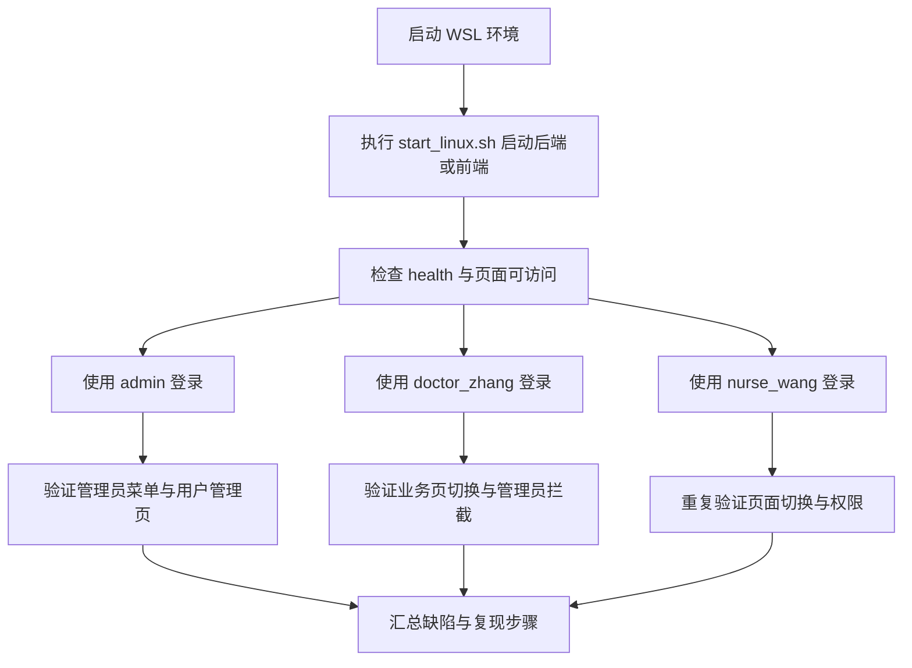

# Vue 前端测试方案

## 1. 测试目标

针对 [`vue-frontend`](vue-frontend) 的登录、页面切换、权限控制与核心业务页面进行手工联调测试，重点覆盖以下场景：

- 普通账号是否可以完成登录并正常访问业务页面
- 管理员账号是否可以访问专属的系统管理页面
- 非管理员账号是否会被正确拦截到非管理员页面
- 页面切换后是否存在空白页、报错、数据不加载、权限错乱、状态残留等问题
- 前端对后端异常返回的提示是否合理

## 2. 可用测试账号

根据 [`sql/init.sql`](sql/init.sql) 与 [`sql/seed.sql`](sql/seed.sql) 当前可用账号如下：

| 角色 | 用户名 | 密码 | 来源 |
|---|---|---|---|
| 管理员 | `admin` | `123456` | [`sql/init.sql`](sql/init.sql:174) |
| 医生 | `doctor_zhang` | `123456` | [`sql/seed.sql`](sql/seed.sql:13) |
| 医生 | `doctor_li` | `123456` | [`sql/seed.sql`](sql/seed.sql:14) |
| 护士 | `nurse_wang` | `123456` | [`sql/seed.sql`](sql/seed.sql:15) |

本轮主测账号建议使用：

- `admin`
- `doctor_zhang`
- `nurse_wang`

## 3. 需要覆盖的前端页面

从 [`vue-frontend/src/router/index.ts`](vue-frontend/src/router/index.ts:5) 可确认主要路由：

- [`/login`](vue-frontend/src/router/index.ts:7)
- [`/dashboard`](vue-frontend/src/router/index.ts:18)
- [`/residents`](vue-frontend/src/router/index.ts:24)
- [`/health`](vue-frontend/src/router/index.ts:30)
- [`/visits`](vue-frontend/src/router/index.ts:36)
- [`/system/users`](vue-frontend/src/router/index.ts:50) 仅管理员可访问

同时，侧边栏渲染逻辑位于 [`vue-frontend/src/layout/index.vue`](vue-frontend/src/layout/index.vue:10)，管理员菜单显示依赖 [`userStore.isAdmin`](vue-frontend/src/store/user.ts:11)。

## 4. 启动前检查项

你当前说明数据库已启动，后续执行测试前建议按以下顺序准备联调环境。

### 4.1 在 WSL 中进入项目目录

参考 [`docs/项目使用说明.md`](docs/项目使用说明.md:323)，进入：

```bash
cd /mnt/e/CppTrainingProject/DatabaseCourseDesign
```

### 4.2 确认脚本权限

[`start_linux.sh`](start_linux.sh:1) 是统一入口，先执行：

```bash
chmod +x ./start_linux.sh
```

### 4.3 优先使用脚本启动

根据 [`start_linux.sh`](start_linux.sh:30) 与 [`docs/项目使用说明.md`](docs/项目使用说明.md:350)，建议实际测试时使用以下方式：

- 联调后端：`./start_linux.sh run`
- 单独起 Vue 前端：`./start_linux.sh run-frontend`
- 查看状态：`./start_linux.sh status`
- 健康检查：`./start_linux.sh health`

### 4.4 联调前确认项

- 后端健康检查返回 200
- 前端可访问 `http://127.0.0.1:8081` 或项目约定端口
- 前端请求基础地址与后端接口一致，见 [`vue-frontend/src/utils/request.ts`](vue-frontend/src/utils/request.ts:8)
- 浏览器开发者工具 Network 与 Console 已打开，便于记录报错

## 5. 详细测试清单

### 5.1 登录页测试

页面：[`vue-frontend/src/views/Login/index.vue`](vue-frontend/src/views/Login/index.vue:1)

#### 用例 L1 空表单提交
- 步骤：直接点击登录
- 预期：出现用户名、密码必填校验；不发送接口请求

#### 用例 L2 错误密码登录
- 步骤：输入存在账号 + 错误密码
- 预期：界面提示登录失败；按钮 loading 恢复；不进入首页

#### 用例 L3 管理员登录
- 账号：`admin / 123456`
- 预期：登录成功，跳转首页，右上角角色显示系统管理员

#### 用例 L4 医生登录
- 账号：`doctor_zhang / 123456`
- 预期：登录成功，跳转首页，不显示系统管理菜单

#### 用例 L5 护士登录
- 账号：`nurse_wang / 123456`
- 预期：登录成功，跳转首页，不显示系统管理菜单

#### 用例 L6 已登录状态访问登录页
- 步骤：登录后手动访问 `#/login`
- 预期：被 [`router.beforeEach()`](vue-frontend/src/router/index.ts:70) 重定向到首页

## 6. 页面切换测试

### 6.1 通用页面切换

适用账号：医生、护士、管理员

依次点击以下菜单并观察：

- 数据概览
- 居民管理
- 健康档案
- 随访管理

每次切换都检查：

- 页面是否正常渲染
- 标题面包屑是否更新，见 [`currentRouteTitle`](vue-frontend/src/layout/index.vue:101)
- 是否出现白屏、长时间 loading、控制台报错
- 重复来回切换 3 轮后，页面数据和表单状态是否异常残留

### 6.2 浏览器前进后退

- 步骤：在多个业务页之间切换后使用浏览器前进、后退
- 预期：路由同步正确；侧边栏高亮与内容一致，见 [`activeMenu`](vue-frontend/src/layout/index.vue:97)

### 6.3 刷新后恢复

- 步骤：登录后在不同页面直接刷新浏览器
- 预期：若本地 token 有效，则保持登录并继续显示当前页面
- 关注：[`localStorage`](vue-frontend/src/store/user.ts:6) 中的用户信息是否足以恢复权限状态

## 7. 权限与管理员专属测试

### 7.1 管理员菜单显示

账号：`admin`

- 预期：侧边栏显示系统管理入口，见 [`v-if="userStore.isAdmin"`](vue-frontend/src/layout/index.vue:38)
- 进入 [`/system/users`](vue-frontend/src/router/index.ts:50) 后页面可访问

### 7.2 非管理员菜单隐藏

账号：`doctor_zhang`、`nurse_wang`

- 预期：侧边栏不显示系统管理入口

### 7.3 非管理员强行访问管理员路由

账号：`doctor_zhang`、`nurse_wang`

- 步骤：登录后手动输入 `#/system/users`
- 预期：被 [`router.beforeEach()`](vue-frontend/src/router/index.ts:70) 拦截并跳转首页

### 7.4 管理员身份识别准确性

重点验证 [`isAdmin`](vue-frontend/src/store/user.ts:11) 与后端返回字段是否一致：

- 是否返回 `role`
- 是否返回 `role_id`
- 是否返回 `username`
- 页面顶部角色显示是否正确，见 [`roleName`](vue-frontend/src/layout/index.vue:65)

## 8. 各业务页重点检查项

### 8.1 数据概览页

页面：[`vue-frontend/src/views/Dashboard/index.vue`](vue-frontend/src/views/Dashboard/index.vue)

检查点：
- 统计卡片是否正常显示
- 图表或数字是否加载成功
- 接口失败时是否有错误提示

### 8.2 居民管理页

页面：[`vue-frontend/src/views/Resident/index.vue`](vue-frontend/src/views/Resident/index.vue)

检查点：
- 列表是否加载
- 搜索、分页、弹窗、新增编辑删除是否正常
- 进入详情或编辑后返回列表是否丢失状态

### 8.3 健康档案页

页面：[`vue-frontend/src/views/Health/index.vue`](vue-frontend/src/views/Health/index.vue)

检查点：
- 档案列表是否显示
- 测量数据、档案详情、筛选项是否正常
- 数字字段异常值显示是否错位

### 8.4 随访管理页

页面：[`vue-frontend/src/views/Visit/index.vue`](vue-frontend/src/views/Visit/index.vue)

检查点：
- 列表与分页是否正常
- 日期、内容、下次随访时间显示是否正确
- 表单提交与回显是否异常

### 8.5 系统用户管理页

页面：[`vue-frontend/src/views/System/Users.vue`](vue-frontend/src/views/System/Users.vue)

仅管理员测试：
- 用户列表加载
- 角色标签显示是否正确
- 新增用户默认角色逻辑是否合理
- 编辑用户时角色、状态、手机号回显是否正常
- 非管理员是否绝对无法进入本页

## 9. 重点风险点

### 风险 R1 管理员识别逻辑可能与后端字段不一致

[`isAdmin`](vue-frontend/src/store/user.ts:11) 同时依赖 `role`、`role_id`、`username`。如果后端登录返回字段为其他命名，可能导致：

- 管理员登录成功但看不到系统管理菜单
- 非管理员误被识别为管理员

这是本轮最高优先级检查项。

### 风险 R2 登录成功后的用户信息结构可能不稳定

在 [`handleLogin()`](vue-frontend/src/views/Login/index.vue:81) 中，`res.data` 会直接传给 [`setAuth()`](vue-frontend/src/store/user.ts:14)。如果响应结构层级变化，会造成：

- token 存储错误
- 刷新后权限丢失
- 顶部用户名或角色显示为空

### 风险 R3 页面切换后状态残留

布局页使用 [`router-view`](vue-frontend/src/layout/index.vue:76) 与过渡动画，若各页面内部没有正确重置查询条件或弹窗状态，容易出现：

- 上一页面条件影响下一次进入
- 编辑弹窗残留旧数据
- 列表切换回来不刷新

### 风险 R4 非管理员手动输入管理员路由的拦截需要实测

虽然 [`router.beforeEach()`](vue-frontend/src/router/index.ts:70) 已配置拦截，但仍需确认：

- 是否真的跳回首页
- 是否会先闪现管理员页面
- 浏览器刷新在管理员页时是否也能拦截

### 风险 R5 接口异常提示是否足够明确

[`request.ts`](vue-frontend/src/utils/request.ts:27) 对 401 与通用错误分别处理，但需要实测：

- 断网或后端未启动时是否只提示泛化错误
- 页面是否卡死在 loading
- 401 后是否能正确清空本地登录状态

## 10. 执行顺序建议



## 11. 建议的缺陷记录模板

- 测试账号
- 访问页面
- 操作步骤
- 实际结果
- 预期结果
- 浏览器 Console 报错
- Network 接口名与状态码
- 是否可稳定复现

## 12. 下一步执行建议

当前最合适的下一步不是直接改代码，而是切换到执行模式后：

1. 在 WSL 中按 [`start_linux.sh`](start_linux.sh) 启动联调环境
2. 逐账号执行上述测试用例
3. 记录缺陷
4. 再决定是否进入修复阶段
